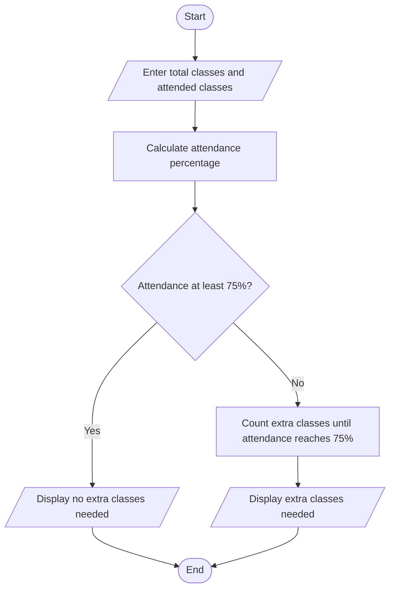

# Simple Flowchart — Attendance Recovery

```mermaid
flowchart TD
 A([Start]) --> B[/Enter total classes and attended classes/]
 B --> C[Calculate attendance percentage]
 C --> D{Attendance at least 75%?}
 D -- Yes --> E[/Display no extra classes needed/]
 D -- No --> F[Count extra classes until attendance reaches 75%]
 F --> G[/Display extra classes needed/]
 E --> H([End])
 G --> H
```