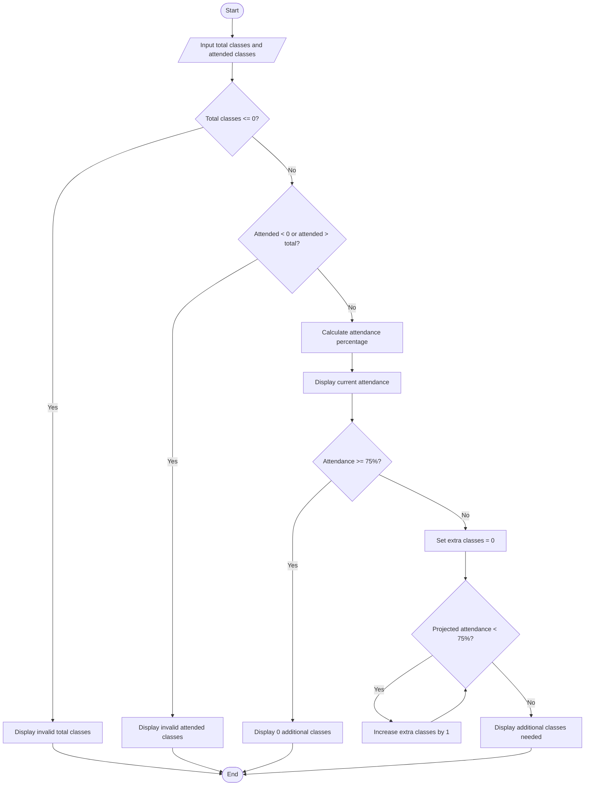

# Flowchart — Attendance Recovery Computation

```mermaid
flowchart TD
    A([Start]) --> B[/Input total classes and attended classes/]
    B --> C{Total classes <= 0?}
    C -- Yes --> D[Display invalid total classes]
    D --> Z([End])
    C -- No --> E{Attended < 0 or attended > total?}
    E -- Yes --> F[Display invalid attended classes]
    F --> Z
    E -- No --> G[Calculate attendance percentage]
    G --> H[Display current attendance]
    H --> I{Attendance >= 75%?}
    I -- Yes --> J[Display 0 additional classes]
    J --> Z
    I -- No --> K[Set extra classes = 0]
    K --> L{Projected attendance < 75%?}
    L -- Yes --> M[Increase extra classes by 1]
    M --> L
    L -- No --> N[Display additional classes needed]
    N --> Z
```
