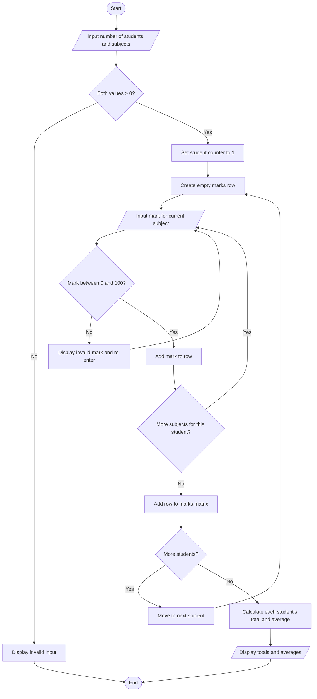

# Flowchart — Student Marks Matrix Analysis

```mermaid
flowchart TD
    A([Start]) --> B[/Input number of students and subjects/]
    B --> C{Both values > 0?}
    C -- No --> D[Display invalid input]
    D --> Z([End])
    C -- Yes --> E[Set student counter to 1]
    E --> F[Create empty marks row]
    F --> G[/Input mark for current subject/]
    G --> H{Mark between 0 and 100?}
    H -- No --> I[Display invalid mark and re-enter]
    I --> G
    H -- Yes --> J[Add mark to row]
    J --> K{More subjects for this student?}
    K -- Yes --> G
    K -- No --> L[Add row to marks matrix]
    L --> M{More students?}
    M -- Yes --> N[Move to next student]
    N --> F
    M -- No --> O[Calculate each student's total and average]
    O --> P[/Display totals and averages/]
    P --> Z
```
