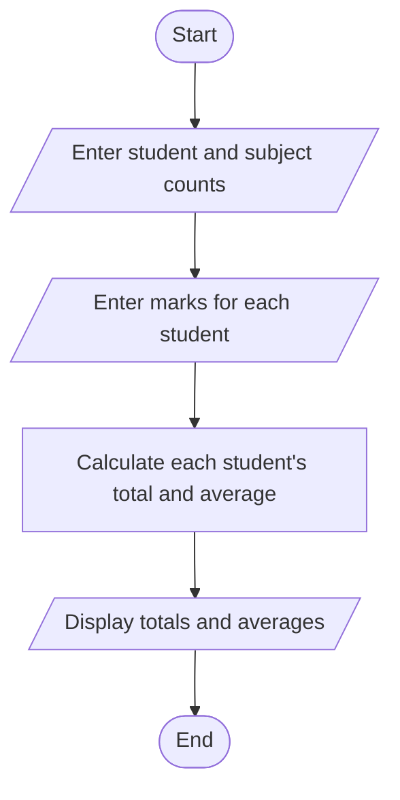

# Simple Flowchart — Student Marks Analysis

```mermaid
flowchart TD
 A([Start]) --> B[/Enter student and subject counts/]
 B --> C[/Enter marks for each student/]
 C --> D[Calculate each student's total and average]
 D --> E[/Display totals and averages/]
 E --> F([End])
```