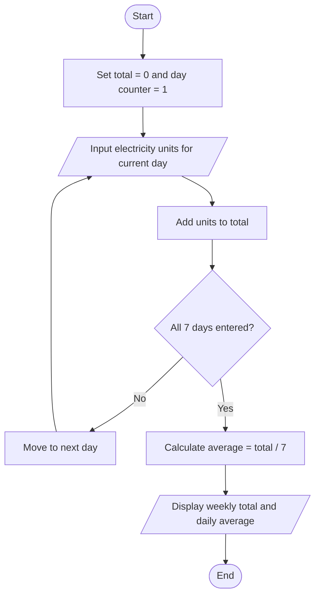

# Flowchart — Weekly Electricity Consumption

```mermaid
flowchart TD
    A([Start]) --> B[Set total = 0 and day counter = 1]
    B --> C[/Input electricity units for current day/]
    C --> D[Add units to total]
    D --> E{All 7 days entered?}
    E -- No --> F[Move to next day]
    F --> C
    E -- Yes --> G[Calculate average = total / 7]
    G --> H[/Display weekly total and daily average/]
    H --> I([End])
```
