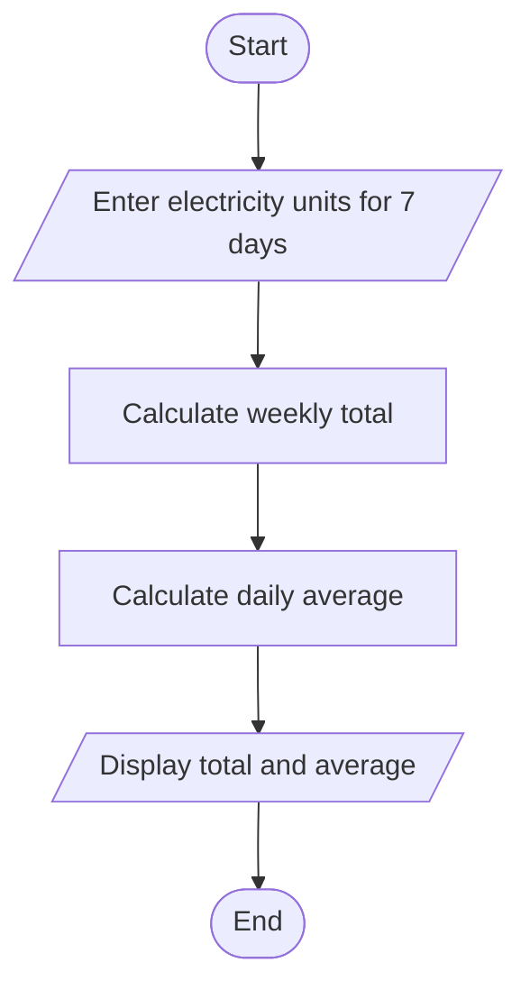

# Simple Flowchart — Weekly Electricity Consumption

```mermaid
flowchart TD
 A([Start]) --> B[/Enter electricity units for 7 days/]
 B --> C[Calculate weekly total]
 C --> D[Calculate daily average]
 D --> E[/Display total and average/]
 E --> F([End])
```