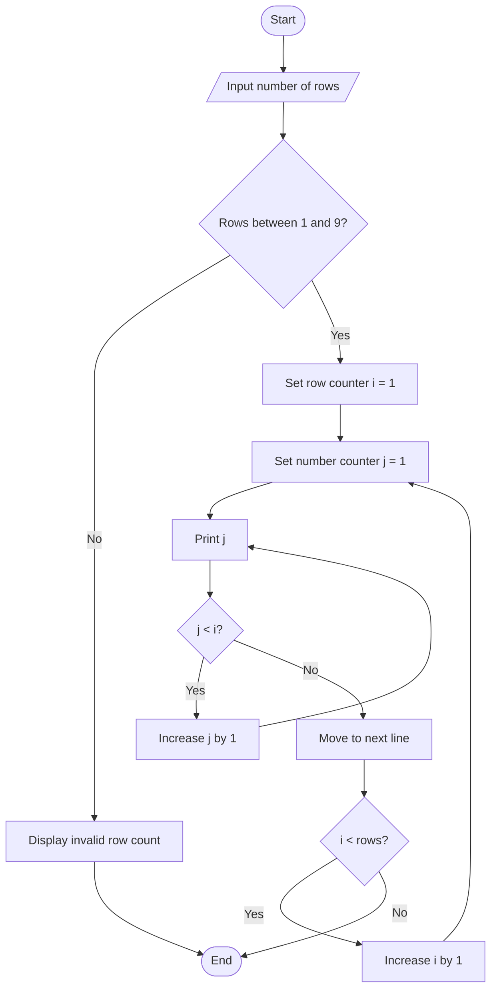

# Flowchart — Numeric Pattern Generator

```mermaid
flowchart TD
    A([Start]) --> B[/Input number of rows/]
    B --> C{Rows between 1 and 9?}
    C -- No --> D[Display invalid row count]
    D --> Z([End])
    C -- Yes --> E[Set row counter i = 1]
    E --> F[Set number counter j = 1]
    F --> G[Print j]
    G --> H{j < i?}
    H -- Yes --> I[Increase j by 1]
    I --> G
    H -- No --> J[Move to next line]
    J --> K{i < rows?}
    K -- Yes --> L[Increase i by 1]
    L --> F
    K -- No --> Z
```
