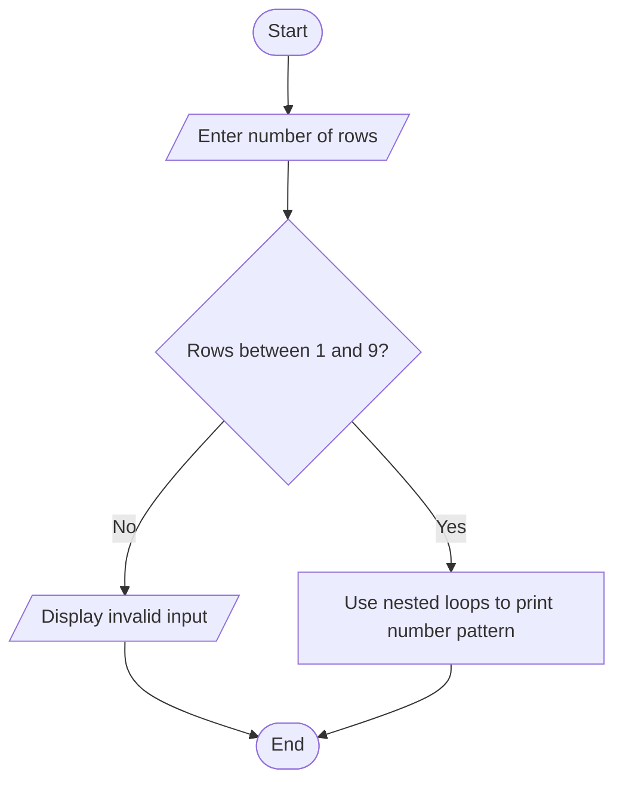

# Simple Flowchart — Numeric Pattern Generator

```mermaid
flowchart TD
 A([Start]) --> B[/Enter number of rows/]
 B --> C{Rows between 1 and 9?}
 C -- No --> D[/Display invalid input/]
 C -- Yes --> E[Use nested loops to print number pattern]
 D --> F([End])
 E --> F
```