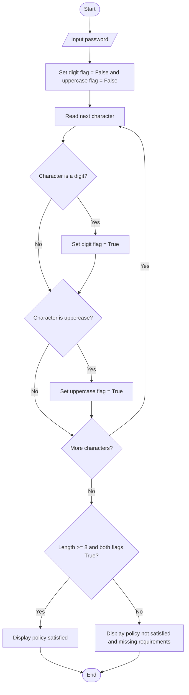

# Flowchart — Password Policy Validation

```mermaid
flowchart TD
    A([Start]) --> B[/Input password/]
    B --> C[Set digit flag = False and uppercase flag = False]
    C --> D[Read next character]
    D --> E{Character is a digit?}
    E -- Yes --> F[Set digit flag = True]
    E -- No --> G{Character is uppercase?}
    F --> G
    G -- Yes --> H[Set uppercase flag = True]
    G -- No --> I{More characters?}
    H --> I
    I -- Yes --> D
    I -- No --> J{Length >= 8 and both flags True?}
    J -- Yes --> K[Display policy satisfied]
    J -- No --> L[Display policy not satisfied and missing requirements]
    K --> Z([End])
    L --> Z
```
