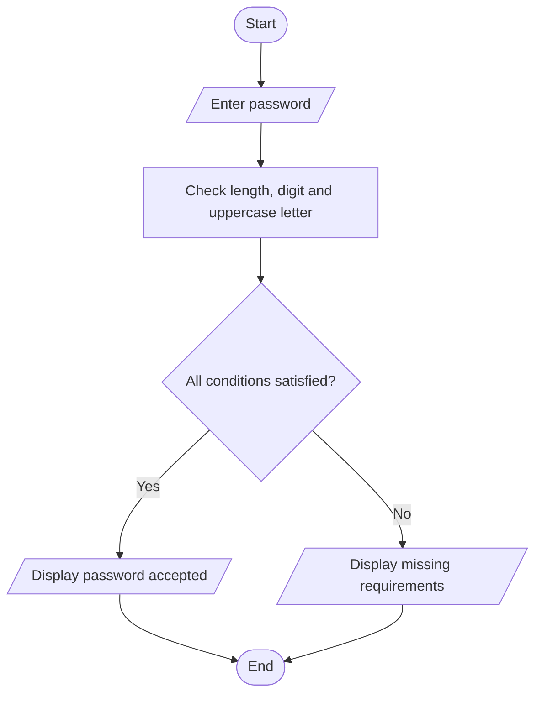

# Simple Flowchart — Password Validation

```mermaid
flowchart TD
 A([Start]) --> B[/Enter password/]
 B --> C[Check length, digit and uppercase letter]
 C --> D{All conditions satisfied?}
 D -- Yes --> E[/Display password accepted/]
 D -- No --> F[/Display missing requirements/]
 E --> G([End])
 F --> G
```