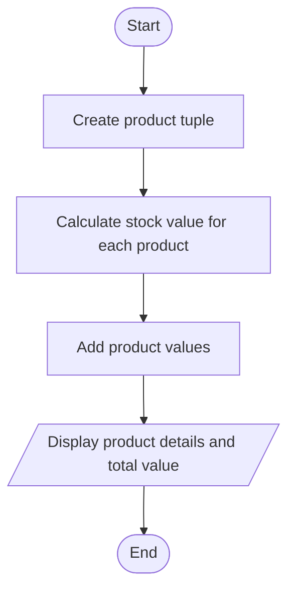

# Simple Flowchart — Product Catalogue Audit

```mermaid
flowchart TD
 A([Start]) --> B[Create product tuple]
 B --> C[Calculate stock value for each product]
 C --> D[Add product values]
 D --> E[/Display product details and total value/]
 E --> F([End])
```