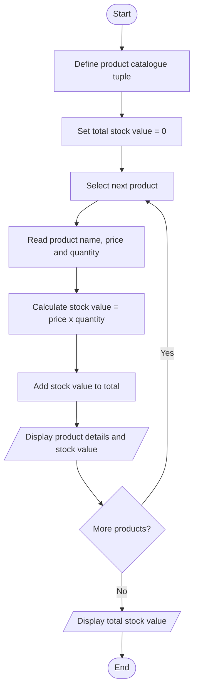

# Flowchart — Tuple-Based Product Catalogue Audit

```mermaid
flowchart TD
    A([Start]) --> B[Define product catalogue tuple]
    B --> C[Set total stock value = 0]
    C --> D[Select next product]
    D --> E[Read product name, price and quantity]
    E --> F[Calculate stock value = price x quantity]
    F --> G[Add stock value to total]
    G --> H[/Display product details and stock value/]
    H --> I{More products?}
    I -- Yes --> D
    I -- No --> J[/Display total stock value/]
    J --> Z([End])
```
