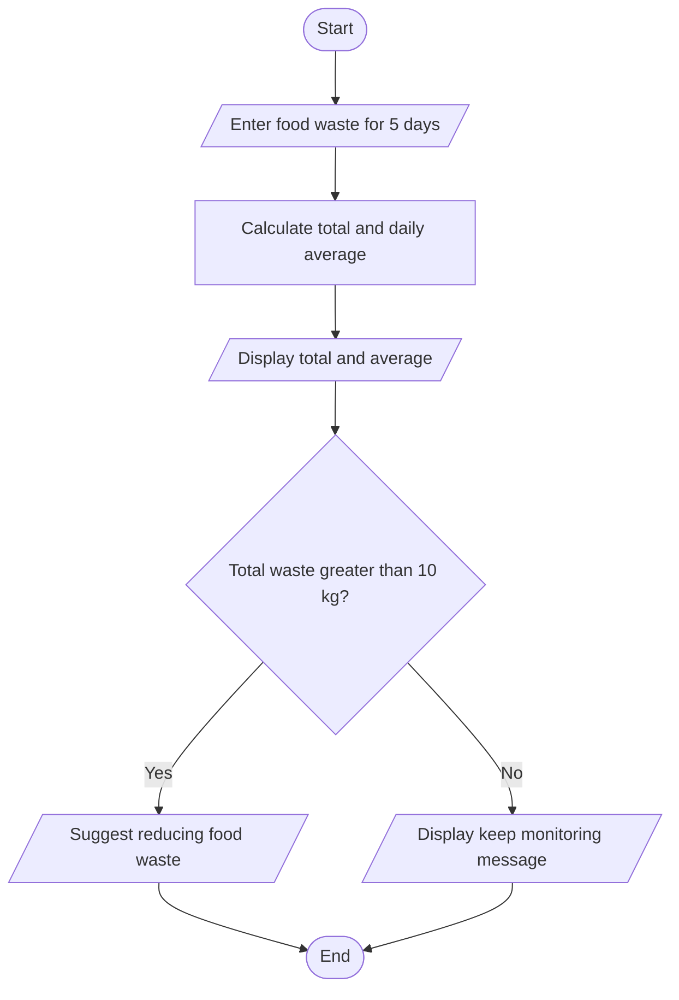

# Simple Flowchart — Food Waste Monitoring

```mermaid
flowchart TD
 A([Start]) --> B[/Enter food waste for 5 days/]
 B --> C[Calculate total and daily average]
 C --> D[/Display total and average/]
 D --> E{Total waste greater than 10 kg?}
 E -- Yes --> F[/Suggest reducing food waste/]
 E -- No --> G[/Display keep monitoring message/]
 F --> H([End])
 G --> H
```