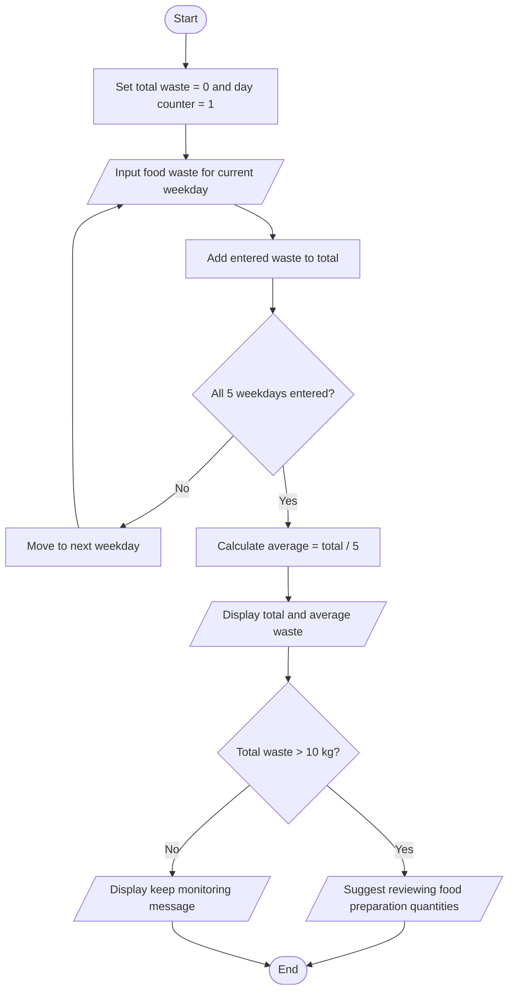

# Flowchart — Food Waste Monitoring System

```mermaid
flowchart TD
    A([Start]) --> B[Set total waste = 0 and day counter = 1]
    B --> C[/Input food waste for current weekday/]
    C --> D[Add entered waste to total]
    D --> E{All 5 weekdays entered?}
    E -- No --> F[Move to next weekday]
    F --> C
    E -- Yes --> G[Calculate average = total / 5]
    G --> H[/Display total and average waste/]
    H --> I{Total waste > 10 kg?}
    I -- Yes --> J[/Suggest reviewing food preparation quantities/]
    I -- No --> K[/Display keep monitoring message/]
    J --> Z([End])
    K --> Z
```
