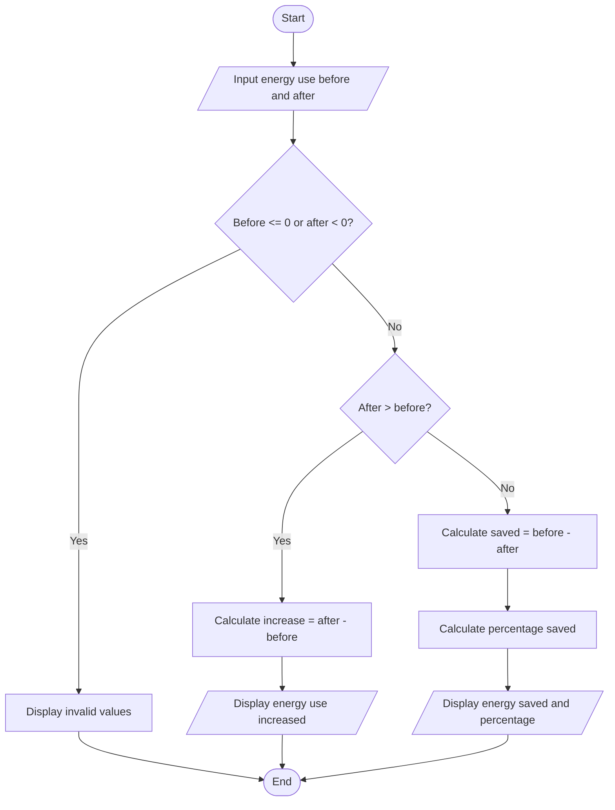

# Flowchart — Energy Conservation Analysis

```mermaid
flowchart TD
    A([Start]) --> B[/Input energy use before and after/]
    B --> C{Before <= 0 or after < 0?}
    C -- Yes --> D[Display invalid values]
    D --> Z([End])
    C -- No --> E{After > before?}
    E -- Yes --> F[Calculate increase = after - before]
    F --> G[/Display energy use increased/]
    G --> Z
    E -- No --> H[Calculate saved = before - after]
    H --> I[Calculate percentage saved]
    I --> J[/Display energy saved and percentage/]
    J --> Z
```
