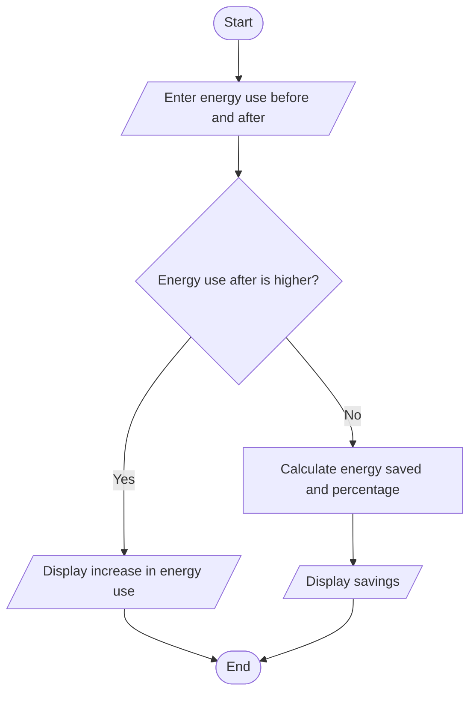

# Simple Flowchart — Energy Savings Analysis

```mermaid
flowchart TD
 A([Start]) --> B[/Enter energy use before and after/]
 B --> C{Energy use after is higher?}
 C -- Yes --> D[/Display increase in energy use/]
 C -- No --> E[Calculate energy saved and percentage]
 E --> F[/Display savings/]
 D --> G([End])
 F --> G
```