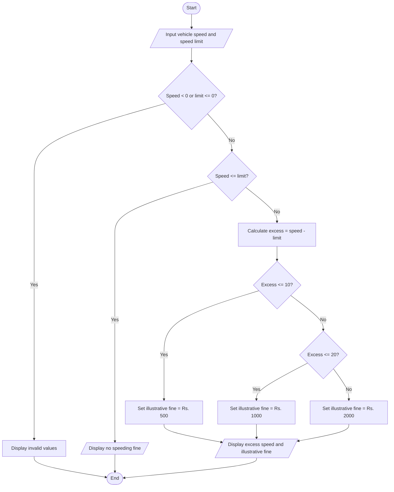

# Flowchart — Traffic Violation Penalty Calculator

```mermaid
flowchart TD
    A([Start]) --> B[/Input vehicle speed and speed limit/]
    B --> C{Speed < 0 or limit <= 0?}
    C -- Yes --> D[Display invalid values]
    D --> Z([End])
    C -- No --> E{Speed <= limit?}
    E -- Yes --> F[/Display no speeding fine/]
    F --> Z
    E -- No --> G[Calculate excess = speed - limit]
    G --> H{Excess <= 10?}
    H -- Yes --> I[Set illustrative fine = Rs. 500]
    H -- No --> J{Excess <= 20?}
    J -- Yes --> K[Set illustrative fine = Rs. 1000]
    J -- No --> L[Set illustrative fine = Rs. 2000]
    I --> M[/Display excess speed and illustrative fine/]
    K --> M
    L --> M
    M --> Z
```
