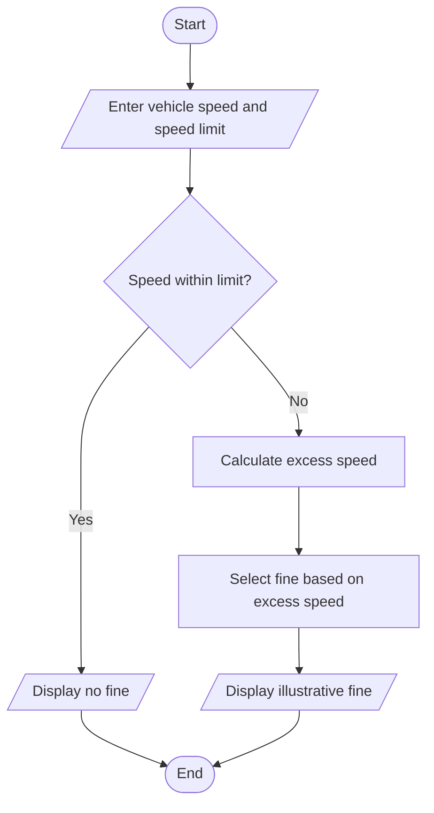

# Simple Flowchart — Traffic Fine Calculator

```mermaid
flowchart TD
 A([Start]) --> B[/Enter vehicle speed and speed limit/]
 B --> C{Speed within limit?}
 C -- Yes --> D[/Display no fine/]
 C -- No --> E[Calculate excess speed]
 E --> F[Select fine based on excess speed]
 F --> G[/Display illustrative fine/]
 D --> H([End])
 G --> H
```