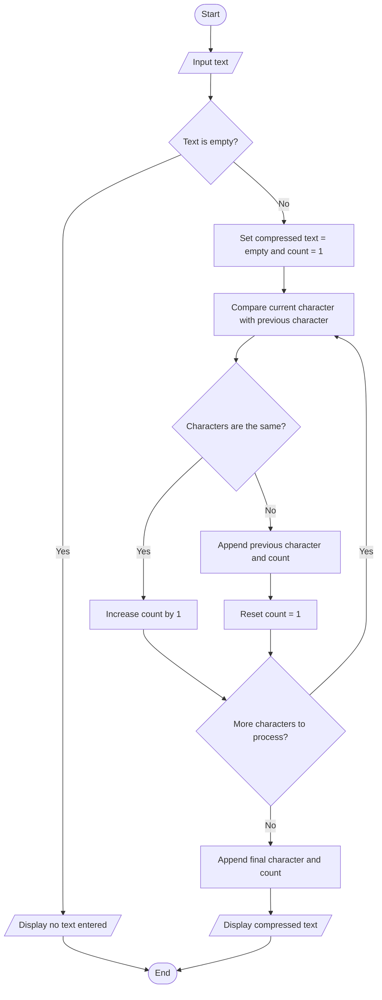

# Flowchart — Text Compression Using Character Runs

```mermaid
flowchart TD
    A([Start]) --> B[/Input text/]
    B --> C{Text is empty?}
    C -- Yes --> D[/Display no text entered/]
    D --> Z([End])
    C -- No --> E[Set compressed text = empty and count = 1]
    E --> F[Compare current character with previous character]
    F --> G{Characters are the same?}
    G -- Yes --> H[Increase count by 1]
    G -- No --> I[Append previous character and count]
    I --> J[Reset count = 1]
    H --> K{More characters to process?}
    J --> K
    K -- Yes --> F
    K -- No --> L[Append final character and count]
    L --> M[/Display compressed text/]
    M --> Z
```
