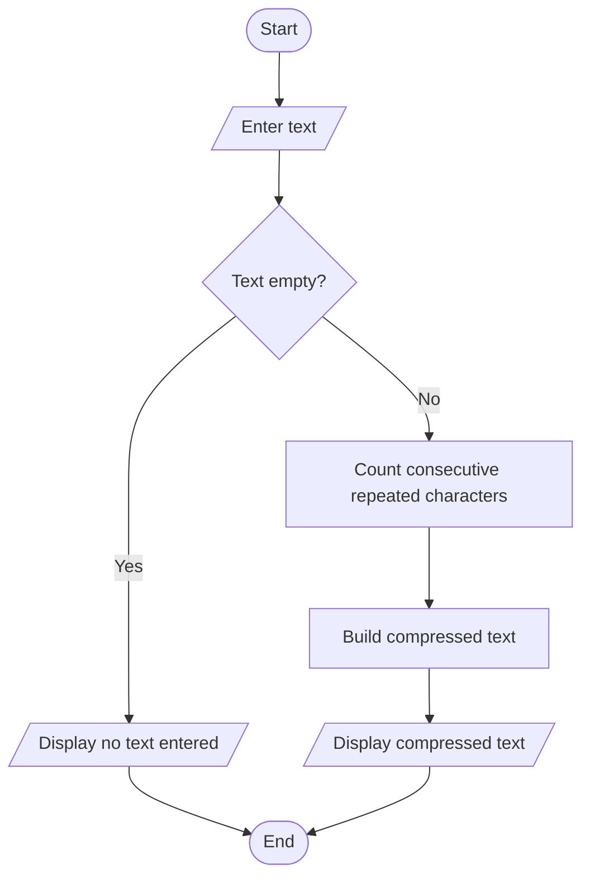

# Simple Flowchart — Text Compression

```mermaid
flowchart TD
 A([Start]) --> B[/Enter text/]
 B --> C{Text empty?}
 C -- Yes --> D[/Display no text entered/]
 C -- No --> E[Count consecutive repeated characters]
 E --> F[Build compressed text]
 F --> G[/Display compressed text/]
 D --> H([End])
 G --> H
```